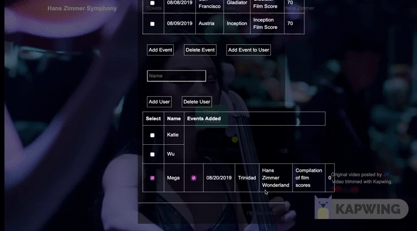

DISLCLAIMER:  I do not own the content of the background video on this GitHub repo. I am using 2 minutes and 18 seconds of video from [YouTuber Jiří](https://www.youtube.com/watch?v=Y1UiD2sxoWo) in fair use to showcase my Object-Oriented Programming (OOP) webpage project. 

Built and tested with: jQuery, Bootstrap, Jasmine.js

Bugs that need fixing: 
- Clear radial buttons after "Add Event to User" button click.
- Remove "Events Added" under the User Table when no user has events added.  

Future Features: 
- Search bar to filter through Events and Users

Below are gifs showcasing the functionalities of my OOP project. 
Current features include: 

- Adding Users to the Users’ List

- Adding Events to the Events List

- Adding Events to the Users’ List

- Deleting Events on the Events List

- Deleting Users on the Users’ List
