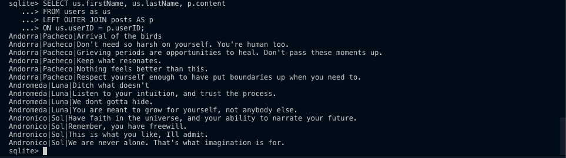

Since the twitter.sqlite3 file is not readable, this independent practice will be displayed via a README.md.

Create table of user and post to answer the following queries: 
!(usersAndpostsTable.png)

Queries to get:
    All tweets by all users:
    
    This query gets all tweets by all users. To get all tweets by a specific user, we will add the following line on the last line: WHERE us.firstName = "Andromeda".

    10 Most Recent Tweets By any user:
    

    Use JOIN to get user's info along with their tweets:
    

    Make up a query of my own: 
    * This is displayed by making a TIMESTAMP field under the posts column.

Add bio field under the users table: 

Queries to get with bio field: 
    Bios of all users in the databases: 
    

    List of users that have no bio:
    

    Name of those users that have no bio:
    

